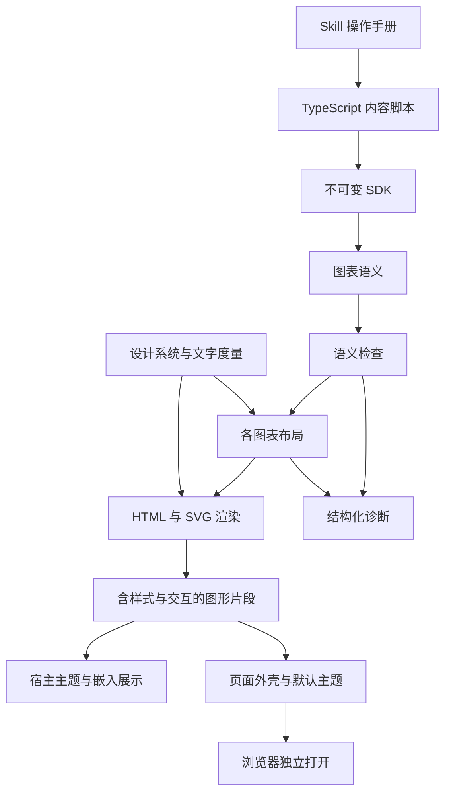

# 架构

SDK 是内容作者的边界。作者声明身份、职责、关系、顺序、组件分区、流程泳道和分类标签，首次声明无需几何信息；设计系统决定尺寸、颜色、字形度量和绘制规则。布局默认自动计算，作者可主动声明位置与连接边约束，并根据诊断、几何检查报告或预览修正。每次编译只处理一张图，输出可以是独立 HTML 页面，也可以是交给宿主展示的嵌入片段。

架构图表达职责划分与结构依赖，分区表示共同职责、归属或部署边界；节点选择围绕同一抽象层次，跨区关系说明所依赖的能力或契约。类清单和执行步骤不直接等同于架构，调用顺序由时序图表达，活动流转由泳道图表达。

## 模块责任

| 模块                     | 输入与输出                     | 责任                                                             |
| ------------------------ | ------------------------------ | ---------------------------------------------------------------- |
| `index.ts`               | 内容脚本的公开入口             | 构造函数、HTML 渲染函数、几何检查入口、输入与报告类型、诊断      |
| `types.ts`               | 共用声明类型                   | 对象、角色、位置、对齐、关系输入及其可选值                       |
| `architecture/index.ts`  | 架构图输入类型                 | 节点、分区与图表选项                                             |
| `sequence/index.ts`      | 时序图输入类型                 | 参与者、分区、消息输入与图表选项                                 |
| `swimlane/index.ts`      | 泳道图输入类型                 | 泳道、活动节点与图表选项                                         |
| 各图表的 `model.ts`      | 内部语义与布局类型             | 规范化声明、场景及图表专属几何                                   |
| `model.ts`               | 内部图表联合类型与整体语义数据 | 汇合三种图表的声明、语义与布局结果                               |
| `shared/model.ts`        | 内部共用语义与几何类型         | 规范化关系、节点和连线几何、布局上下文                           |
| `sdk.ts`                 | TypeScript 调用到图表语义      | 不可变内容声明、可选位置约束、对象和职责归并                     |
| `validate.ts`            | 图表语义到合法图表或诊断       | 标签一致性、唯一性、分区和泳道归属与容量检查                     |
| `sequence/validate.ts`   | 时序消息到诊断                 | 同步调用栈、异步消息与响应关联检查                               |
| `design.ts`              | 角色和文字到颜色与固定排版度量 | 统一视觉规则，不接受内容脚本的样式覆盖                           |
| `architecture/layout.ts` | 架构声明到几何结果             | 按依赖排布节点和分区、自动计算边界、检查显式位置冲突             |
| `swimlane/layout.ts`     | 泳道声明到几何结果             | 按流程排布活动、自动计算泳道尺寸、检查显式位置冲突               |
| `shared/placement.ts`    | 矩形和依赖关系到局部坐标       | 确定性分层、保留显式位置、解析中心对齐、自动避开占用区域         |
| `shared/layout.ts`       | 共用节点与场景到几何结果       | 节点文字排版、画布尺寸检查与路径生成                             |
| `shared/routing.ts`      | 位置和关系到连接路径           | 正交路由、障碍检查与沿线标签；泳道连线限制在内容范围内           |
| `sequence/layout.ts`     | 时序语义到几何结果             | 参与者分区、同步执行条、异步消息、响应与自调用                   |
| `render.ts`              | 合法图表和几何结果到 HTML 片段 | 单图、图例和结构化节点资料，以及独立页面包装                     |
| `inspect.ts`             | 图表声明到几何检查报告         | 汇总布局警告、画布、节点矩形与中心、容器原点、连线路径和标签位置 |
| `warnings.ts`            | 场景几何到非致命布局判断       | 近乎对齐、可消除折弯与标签拥挤的检查                             |
| `render-svg.ts`          | 几何结果到 SVG                 | 节点链接、分区、泳道及标题栏、关系与执行条                       |
| `templates.ts`           | HTML 模板与占位值到 HTML       | 加载固定模板、转义文字并插入已生成的标记                         |
| `templates/`             | 片段模板、样式和交互源码       | 片段外框与节点资料、CSS、节点旁详情浮层和图内定位                |

SDK 与示例使用 TypeScript，浏览器交互使用带 JSDoc 类型标注的 JavaScript，统一进行严格类型检查。输入声明、图表语义和布局结果分别建模；运行时校验负责检查动态 JavaScript 数据、引用关系及几何约束。浏览器脚本原样读取，不编译或通过 `Function.toString()` 生成。最终片段不携带 TypeScript 编译器。

Node 直接运行 TypeScript 源码，无需项目构建。模板资源按模块文件的位置加载，不依赖调用方的工作目录；渲染时内嵌 CSS 和 JS，两种输出都不含外部资源。独立页面可通过 `file://` 打开，不需要服务器。

片段骨架、图表外框和节点资料分别放在 `src/templates/` 的 HTML 文件中，样式在 `diagram.css`，交互源码在 `interactions.js`。模板只做一次固定占位符替换：`{{name}}` 转义文字，`{{{name}}}` 插入渲染器生成的 HTML 或内置 CSS、JS；替换结果不再次解析。循环和条件仍由 TypeScript 处理，不引入模板引擎或执行模板表达式。SVG 几何绘制由渲染器生成。

内容脚本从 Skill 目录的 `src/index.ts` 导入接口，直接通过 `node diagram.ts` 执行。脚本调用渲染函数取得 HTML，再用 Node 的 `writeFile()` 保存；输出路径由脚本指定，相对路径基于进程工作目录。分发的是完整 Skill 目录；在没有依赖和构建产物的目录中验证源码、模板及外部调用。

源码按图表类型分为 `architecture/`（架构图）、`sequence/`（时序图）和 `swimlane/`（泳道图），各自的 `index.ts` 只放内容作者需要的输入声明，共同依赖根目录的 `types.ts`；各自的 `model.ts` 放内部规范化声明与布局结果，时序专属校验也放在 `sequence/`。`shared/` 存放内部共用模型、节点布局与路由；根目录负责 SDK、图表联合类型、通用校验和渲染编排。模块直接引用类型所属文件，根目录 `index.ts` 只导出构造函数、HTML 渲染函数、几何检查入口 `inspect()`、声明与报告类型及诊断。内部类型依赖公开声明，公开声明不反向依赖内部模型；`RelationInput` 完整定义输入，内部 `Relation` 从它派生并收紧规范化字段。没有插件加载层、主题配置协议或多渲染后端抽象。

## 核心数据

三种图表共用 `ChartMeta`，含义是“图表展示信息”，通过必填的 `meta` 字段声明。`meta.title` 是必填的非空标题，`meta.subtitle` 是可选的非空副标题；两者均为纯文本。SDK 使用同一校验函数处理并冻结这些信息，语义数据保留 `meta`。标题用于图形说明、SVG 无障碍名称和独立页面标题，副标题显示在标题下方并进入 SVG 描述。图表 `id` 保留在顶层；节点和区域的文字排版结果仍使用各自的 `title` 字段。

`SemanticDiagram` 表示一张图的语义数据，包含 `version`、`entities`、`roles` 和单个 `chart`。`Diagram` 是由 SDK 创建的声明，`Chart` 是将对象与职责替换为标识后的数据。内部 `compile(diagram)` 返回 `{ semantic, scene, warnings }`，不从公开入口导出；`render(diagram)` 返回完整的嵌入片段，`renderPage(diagram)` 用同一片段生成独立页面，`inspect(diagram)` 将场景投影为 JSON 可序列化的几何检查报告（含非致命布局警告），是作者读取布局结果的公开入口。语义数据不包含节点尺寸，架构和泳道节点保留声明中的可选局部坐标；尺寸与自动坐标只出现在 scene 中；数据不包含函数、DOM 或任意样式，能够直接 JSON 序列化。

脚本将 `architecture(...)`、`sequence(...)` 或 `swimlane(...)` 的结果传给渲染函数，无需默认导出。多个脚本复用的声明放在不写文件的普通模块中，例如示例中的 `system.ts`。SDK 不提供文档组合、正文解析或跨图页面状态。每张图独立生成，需要多个视角时由正常对话组织多个片段。

对象身份与对象在图中的出现分离。图表的 `nodes` 或 `participants` 引用对象标识，并可附带本图角色；角色可省略，省略时统一引用内置默认角色 `defaultRole`，取中性色，不进入图例、调色板和角色注册表。架构对象声明可选的分区归属与局部位置，时序参与者声明可选的分区归属，泳道活动声明必填的泳道归属和可选的局部位置。架构与泳道节点还可以用 `align` 声明与同一容器内另一节点的中心对齐（`axis` 为 `x` 时共享 cx，`y` 时共享 cy），坐标由布局推导；`align` 与 `position` 互斥，不允许自对齐、跨容器目标与循环链条。对象定义包含可选的单行 `description` 摘要与 `tags` 分类标签。标签是限定字段的 `{ id, label }` 数据，不是任意属性容器。对象定义相同即可复用，不依赖 JavaScript 对象引用相等。

`ArchitecturePartition` 的含义是“架构图分区”，只属于当前架构图，表示按共同职责或归属划定的组件分组，例如功能分组或部署区域；它本身不是实体。架构图通过 `partitions` 声明分区，节点用可选的 `partition` 字段声明归属，与时序的 `participant.partition`、泳道的 `node.lane` 同为节点侧声明；未声明归属的节点直接放在画布内容区。每个分区必须非空，节点引用的分区必须已在图中声明；一个节点至多归属一个分区，成员布局顺序沿用图表 `nodes` 的顺序。分区不进入共享身份注册表，不承担角色、详情或关系端点。布局分别输出 `nodes` 和 `partitions`，渲染分别绘制交互节点与非交互虚线框。

`SequencePartition` 表示时序参与者分区，只包含标识和名称。`SequenceParticipant` 用可选的 `partition` 指定归属。分区不进入实体表，不能作为消息端点；成员须在参与者数组中连续排列。时序布局保留参与者顺序，按成员边界计算分区宽度，按消息纵向范围计算高度，并为标题统一预留顶部空间。分区框覆盖成员标题和完整生命线，消息线可以跨越边界，标签按边界分隔出的可用宽度换行，与分区边界保留 12 像素文字间距。架构与时序分区共用绘制外观，尺寸均自动计算，定位规则按图型分别定义。

公共节点声明只包含对象和角色。SDK 分别校验各图表允许的字段，并由架构专属的节点与分区解析函数处理分区声明。共享几何与路由只处理矩形、坐标和障碍，不包含分区语义；时序图另有参与者与分区解析函数，泳道按自身语义定义组织方式。

`Lane` 表示泳道图中的一个负责方，只含本图标识和名称；活动通过 `lane` 指定归属。泳道宽度、高度和共用标题栏宽度由文字与节点边界自动计算，输入不接受 `width`、`headerWidth` 或 `height`。泳道按数组顺序从上到下紧邻排列，活动使用整张图统一的流程层次和列间距。泳道不进入实体表，也不作为关系端点。布局输出 `lanes`，渲染绘制实线边界和负责人标题。

图表具有不同关系模型：架构图使用 `relations` 与独立的 `partitions`，泳道图使用 `relations` 与独立的 `lanes`，时序图使用有序 `messages` 与独立的 `partitions`。泳道关系表达活动流转，多个出边可以附带条件标签，回退仍是方向关系；当前不校验互斥条件、并行执行或 BPMN 网关语义。时序 `Message` 和 `MessageInput` 是独立接口，不继承 `Relation`，不包含 `fromSide`、`toSide`。`MessageKind` 表示消息行为，包含 `sync`（等待响应的调用）、`async`（不等待响应的消息）、`reply`（响应），省略时为 `sync`；只有 `reply` 必须且可以通过 `replyTo` 关联先前消息。`MessageVariant` 表示独立的视觉强调，包含 `default`、`emphasis`、`security`，省略时为 `default`。入口分别校验行为与样式，两者可任意组合。

布局结果保留图表、对象和关系标识，以及矩形、连线路径、标签和执行区间的位置。HTML 通过这些标识建立图内引用；同一对象在本图中只有一份详细资料。

## 确定性与取舍

- 在相同 SDK、Node/ICU 版本和相同输入下，生成的 HTML 字节一致。不写时间戳、随机图形标识或运行时布局脚本。交互脚本是固定的系统代码，不包含内容作者的代码。
- 图中文字采用系统等宽字体和固定前进宽度。前进宽度是排版为字符分配的横向空间；ASCII 为字号的 0.62 倍，其他字素为一倍。按完整 Unicode 字素换行，再将相同宽度写入 SVG 的 `textLength`。这使布局与实际绘制采用相同空间约束，无需浏览器参与构建。
- 字素是用户看到的一个完整字符，例如带音调的字母或组合 emoji。固定前进宽度保证几何可控，但不是自然字体的精密度量；不同系统的字形和正文换行仍可能不同，不能保证跨系统像素完全一致。
- 角色按图内标识排序后映射到当前主题的六个 `--viz-series-*` 分类色，同一图内保持一致。不同图的角色集合不同，颜色可能重新分配；颜色不承担对象身份。省略角色的出现引用内置默认角色 `defaultRole`，使用中性色，不占用调色板，也不进入图例。
- 节点以 10% 角色分类色和 90% 宿主背景色混合填充，以角色分类色绘制边框，边框宽度为 2.5，定位时为 3.5，悬停和键盘聚焦保持原有边框与配色。
- 架构与泳道节点仅提供四条边中点作为连接点，多条关系可以共用中点。架构与泳道关系可用 `fromSide`、`toSide` 分别限定起止侧，省略的一端从四个位置中选择，端点不再按关系数量和顺序沿边分配；自循环使用不同侧。时序消息仍连接生命线和执行条，由调用顺序决定纵向位置。消息文字与生命线及当前嵌套执行条外沿保留至少 20 像素水平间距，标签背景占用其中 3 像素；跨参与者标签在可用区间内居中，自调用标签放在相邻空白区间，并按剩余宽度换行。
- 指定连接边在候选路径生成前过滤可用连接点，后续初次分配和重排始终使用同一组受约束的候选，不添加软约束或自动回退。找不到路线时，`RELATION_LAYOUT` 包含已声明的边与调整建议。SDK 校验边名并拒绝自循环两端显式使用同一边；时序消息在声明入口拒绝连接边字段。
- 架构与泳道路由在障碍外围生成多条平行通道，同时比较标签的居中、靠近线段两端及换行方案。标签最多 3 行，收窄时保留可完整显示的英文词。候选先避开节点、标题和标签，再依次比较与其他关系的重叠长度、交叉数量、线长与转弯代价、标签高度；共同端点的引线也计入重叠长度。引线默认长 18 像素，狭窄通道中缩短到与前方障碍间距的一半，再执行同样的节点避障检查，避免固定引线使可用连接侧失效。先处理指定连接边较多的关系，再按最短可用路径和关系标识确定稳定处理顺序，初次分配后最多重排 3 轮，每次只接受整体目标改善的替换。返回的关系仍按声明顺序排列。优化减少冲突，但不承诺任意图都无重叠或交叉。
- 路由空间区分路径与标签共用的障碍和仅限制标签的障碍。分区标题障碍采用渲染文本块的实际位置和尺寸，由路由统一添加避让距离，避免重复扩大标题范围。架构分区与泳道边框按 1 像素宽的边线加入标签障碍；标签按背景矩形外沿保留 2 像素间距，连线仍能跨区域流转。同排节点间的连接会按这些边框分隔出的空白区间计算标签换行宽度，保留字号和最多 3 行的限制。共享路由只接收矩形，不解释分区或泳道的业务含义。
- `compile()` 根据节点名称、摘要、固定换行宽度范围和内边距计算节点尺寸。输入拒绝 `size`，不会截断文字。架构图先排分区内部，再将分区作为矩形与根节点一起按关系分层；分区边界自动包住成员和标题。泳道按全图依赖层次从左向右安排活动，超过可用列数后换行。深度优先遍历遇到回边时，仅在计算层次时忽略该边，所有关系仍保留并参与寻路。
- `position`、`align`、`fromSide`、`toSide` 可主动表达布局意图，也可用于诊断或预览之后的修正。位置先占用空间，自动节点避开已占用区域；中心对齐在自动排布完成后解析，按引用顺序沿链条推导坐标，越出容器原点时报 `ALIGNMENT_RANGE`。两个显式位置冲突时返回诊断。显式坐标不随自动排布移动，容器尺寸仍自动计算。架构成员相对分区内容原点定位，泳道成员相对标题栏和内边距之后的内容原点定位。输入未声明的坐标不写回语义数据。内部布局中的 `labelX`、`labelY` 是标签文本块左上角的画布绝对坐标，仅供布局与渲染使用；内容作者通过位置、中心对齐、连接边和标签措辞调整布局，用 `inspect()` 的报告读取节点矩形、中心与局部原点，以诊断和 HTML 预览检查效果。
- 自动排布提供可检查的初始布局，不承诺解决任意复杂的障碍排列。架构与泳道共用有限候选的正交路由，调用方提供标题障碍矩形；泳道另外提供整组泳道内容区的边界。无法放置连线或标签时返回诊断，作者据此修正位置或连接边，或缩短文字、拆分图表。
- `compile()` 随布局结果输出非致命警告，由 `inspect()` 的报告携带，不影响渲染输出。检查复用路由的间隙规则：相连节点整体水平排列而垂直中心错位不超过 16 像素（或反之）报 `NEAR_MISS_ALIGNMENT`；两端中心已对齐且直连走廊无节点或分区标题障碍而路径带折弯，报 `AVOIDABLE_BEND`；标签背景距任意拐点小于 6 像素报 `LABEL_CONGESTION`。声明了非对向连接边的关系视为有意绕行，不触发前两类；时序图由固定网格排布，不产生警告。
- `kind: "sync"` 在接收者上开启执行条，配对的 `kind: "reply"` 响应结束执行条。自调用和递归通过横向错开的执行条表达。`kind: "async"` 不进入同步调用栈、不创建执行条，也不要求响应；若有响应，仅校验关联、方向与唯一性，不关闭同步执行条。`variant` 不参与这些判断。当前仅有一条同步调用栈，不建模条件分支、循环或多个并行执行栈。
- 片段容器使用宿主提供的可用宽度，背景、文字与角色颜色引用宿主 CSS 主题变量，随应用主题变化自动重新绘制。CSS 限定在 `.diagram-widget` 内，不设置 `html`、`body`、`:root`、`color-scheme` 或宿主主题变量。嵌入时主题由宿主处理；独立页面通过 `page.html` 和 `page.css` 提供页面结构及完整配色，用 `prefers-color-scheme` 跟随浏览器明暗偏好。页面样式仅随独立输出提供，不进入嵌入片段。不添加主题监听脚本。容器宽度不足时整张 SVG 等比例缩小，文字一同缩放。时序图参与者之间保留 40 像素的原始间距。画布宽度上限为 1280 像素。
- 图表通过 SVG 标题、说明和节点名称提供可访问信息，颜色之外保留对象标签与关系方向。架构关系直接在线旁标注；时序消息保留阅读编号。

## 容器缩放

架构自动布局在分区内部和根级别都按依赖分层，方向由声明的 `direction` 决定：默认 `vertical` 自上而下，来自 `placeBoxes()` 默认的 `horizontal: false`；`horizontal` 自左向右排列层级。混合组织方式仍通过节点与分区的 `position` 表达。默认排布只是初稿，不代表架构关系应画成纵向流程；应结合职责之间的并列或层级关系及实际展示宽度选择方向和位置。

编译仅计算一份几何布局，渲染输出一张带原始宽高和 `viewBox` 的 SVG。CSS 的 `max-width: 100%` 与 `height: auto` 使其按可用宽度等比例缩小，宽度充足时保持原始尺寸。不使用容器查询、宽度档位或浏览器布局脚本。

节点、连线、文字、分区、泳道和时序执行结构一同缩放，原始几何不变。标题与角色图例在图形外保持正常字号并换行。高度按比例自然变化，整个图表随宿主页面滚动，不限制区域高度，不引入内部滚动。

渲染函数内部通过 `compile(diagram)` 检查语义并计算几何布局。内容脚本直接调用 `render()` 或 `renderPage()`；`Scene`、各图表场景和 `compile()` 属于内部实现，不作为 agent 生成图表的阅读入口，读取布局结果使用 `inspect()` 的几何检查报告。

## 错误与执行边界

声明错误在 SDK 调用处返回，同一数组内的字段错误聚合为一次 `DiagnosticError`。语义检查尽量汇总多个引用或关系错误；布局遇到重叠、连线无法放置、文字或尺寸超限时停止并给出位置和修改建议。不会删除关系、截断文字或自动改变语义；原始声明和几何保持不变，浏览器仅缩放显示。

内容脚本是由 Node 直接执行的本地 ES module，拥有普通 Node 进程的权限。最终 HTML 不包含作者脚本，布局与内容已经在构建阶段确定。

节点详情当前由 `design.ts` 中的 `nodeDetailsEnabled` 开关停用，意为是否启用节点详情；恢复为 `true` 即重新启用。节点不再显示详情链接或提示，悬停与键盘强调不受影响。详情模板、资料和交互实现保留。以下描述启用后的行为。

节点资料由已有的名称、摘要、标签、职责、分区或泳道归属与关系生成。固定交互脚本通过根元素标识查找当前片段，只在根元素内查询节点和处理点击。点击节点用原生 `popover` 显示对应资料，点击关联节点关闭详情，并定位图中的目标、聚焦和高亮。关闭按钮或 Escape 从浮层内关闭时将焦点还给打开入口；点击图中空白清除定位标记。

详情没有富文本或自由正文入口。内容统一转义，只有内置模板和脚本能产生标记。脚本不改写地址片段、浏览器历史或宿主根元素，不依赖网络与全局页面事件。浮层优先贴近节点侧边，空间不足时放在上方或下方，并按当前嵌入容器边界约束位置。它不显示蒙层，不限制键盘焦点，点击其他节点直接切换详情。原生 `popover` 管理点击外部与 Escape 关闭；图表滚动和尺寸变化时重新定位。片段不创建完整页面；只有 `renderPage()` 添加完整页面外壳。

`renderPage(diagram)` 返回独立页面，`render(diagram)` 返回嵌入片段。示例先完成渲染，再创建输出目录并写文件；声明、检查或布局失败不会覆盖旧产物。文件写入直接使用 Node API，不保证原子替换。错误按普通脚本异常传播，`DiagnosticError.diagnostics` 保留结构化的错误代码、位置、说明和修改建议。

架构图、时序图和泳道图共用节点悬停与键盘聚焦的关联强调。SVG 渲染器根据关系两端生成直接相邻节点集合和当前图表范围内的 CSS `:has()` 选择器，覆盖入线、出线、自循环和返回线。当前节点、直接相邻节点及相连关系保持完整不透明度，其余节点、路径和关系标签降至 0.45；强调范围只扩展一层，孤立节点也能单独聚焦。关系的 `variant`（样式预设）在 SDK 入口校验并补全为 `default`，随语义数据和布局结果传递。`relationStyles`（关系样式表）在设计层集中定义六种预设的主题色、线宽、虚线模式、字重和箭头形状。渲染按预设绘制关系路径、箭头和文字，不读取起点或终点的节点颜色。悬停或聚焦时保留预设颜色和线型，线宽增加 1，文字加粗。时序消息的 `messageKindStyles`（消息种类样式表）按 `kind` 定义线型与箭头：同步调用使用实线实心箭头，异步消息使用实线开放箭头，响应使用虚线开放箭头。`messageStyles`（消息强调样式表）定义颜色、线宽与字重；`default` 使用宿主正文色 `--foreground`，`emphasis` 使用紫色加粗，`security` 使用红色。渲染先取种类样式，再叠加强调样式。颜色和粗细不改变消息行为及箭头形状，SVG 路径分别保留 `data-kind` 和 `data-variant`。消息与关系的布局结果只共享坐标、路径和标签等几何字段，各自定义预设类型；只有关系布局包含连接边。开口箭头按常态及悬停的实际线宽生成标记，尺寸固定。

悬停单条关系线或其文字时，仅强调该关系及其起点和终点，不延伸到端点的其他关系或相邻节点。每条关系增加沿原路径的透明命中区域，宽度为 12 屏幕像素，不随图表缩放变窄，绘制在节点下方以保留节点的悬停入口。关系命中区域与文字使用相同的强调范围，自循环只强调一个端点。

节点强调使用全图统一的中性阴影色，由 `--node-shadow-color`（节点阴影颜色）引用宿主前景色并混入透明度，随明暗主题变化。当前节点的阴影范围比相邻节点更大，二者颜色相同。悬停和键盘聚焦时保留原有边框颜色与粗细，不进一步加粗；键盘焦点轮廓仍保留。阴影只作用于节点矩形，文字保持锐利；通过阴影和背景弱化形成前后层次，不改变节点坐标、尺寸或绘制顺序。选择器跟随 `:hover` 和 `:focus-visible` 状态自动恢复，不增加 JavaScript 状态或事件监听，也不会联动其他图中的同名节点。阴影、不透明度和关系加粗均立即切换，不添加过渡动画，避免快速移动指针时出现滞后。强调规则仅用于屏幕显示；定位标记继续由原有交互逻辑维护。

箭头的 `context-stroke` 表示使用所属关系路径的描边颜色，使复用同一箭头形状的不同关系各自保留颜色。箭头使用 `markerUnits="userSpaceOnUse"`，按画布单位固定尺寸，避免高亮线条加粗时箭头同步放大。返回箭头的绘制区域为描边保留边距，并用箭头内的实线短杆连接尖端，避免虚线末段恰好落在间隙时出现断开；普通和高亮状态共用相同的箭头几何形状。

## 验证

`pnpm typecheck` 运行 TypeScript 严格检查，`pnpm lint` 与 `pnpm fmt:check` 检查代码。直接用 Node 执行示例验证声明、语义校验、布局与 HTML 输出的完整路径；不添加单元测试。`pnpm example`、`pnpm example:sequence` 与 `pnpm example:swimlane` 分别生成三种图表片段，`pnpm examples` 运行全部示例。特性示例按 `<图表>-<特性>.ts` 命名：`examples/architecture-alignment.ts` 展示固定位置与中心对齐声明的配合，`examples/architecture-relations.ts` 在同一张图中展示六种关系样式预设与连接边约束，`examples/sequence-message-variants.ts` 展示消息行为与视觉强调的独立组合、异步响应与无需响应的通知，`examples/sequence-partitions.ts` 展示参与者分区与跨区调用。

浏览器检查包括详情打开、关闭与焦点恢复、关联节点定位、分区与泳道边界、沿线文字、执行条与返回箭头，以及 320 至 1024 像素容器内的等比缩放、文字可读性和横向溢出。检查时可将片段放在测试页面的 iframe 中模拟宿主；独立页面直接在浏览器检查，不注入 Codex 样式；两种输出共用相同的几何与交互。仅测试语义模型不能证明视觉可读性。
