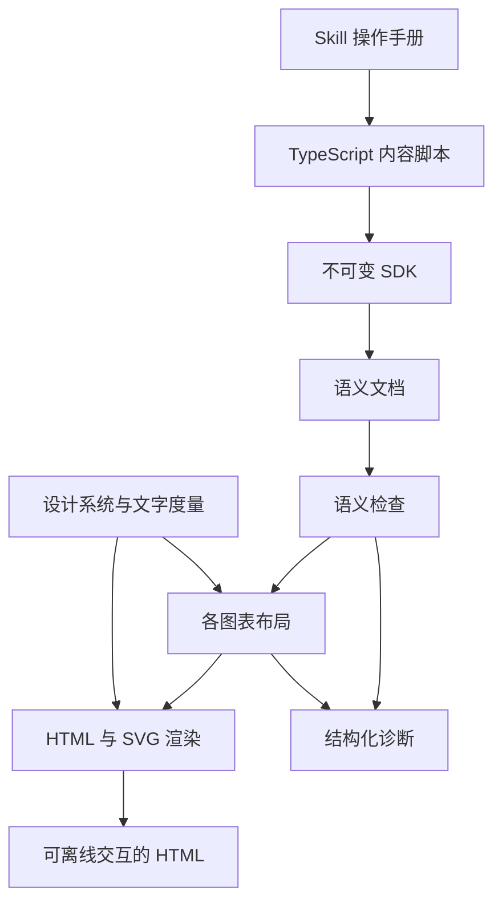

# 架构

SDK 是内容作者的边界。作者声明身份、职责、关系、顺序、组件分区、分类标签、节点宽高和架构节点的 x、y 位置；设计系统决定颜色、字形度量和绘制规则。单图与报告由同一份文档模型处理。

## 模块责任

| 模块 | 输入与输出 | 责任 |
| --- | --- | --- |
| `model.ts` | 输入声明、语义文档与布局结果的类型 | 用只读字段和可区分的类型表达数据约束 |
| `sdk.ts` | TypeScript 调用到语义文档 | 不可变组合、图表声明、位置与尺寸声明、共享身份和标签归并 |
| `markdown.ts` | Markdown 到块结构 | 解析标题、表格、列表、引用、代码和定义，保留源行号，再解析行内内容 |
| `markdown-inline.ts` | 行内文字到文字结构 | 解析强调、代码和链接，处理转义、字符引用与地址校验 |
| `validate.ts` | 语义文档到合法文档或诊断 | 文档引用、标签一致性、唯一性、分区归属与容量检查 |
| `validate-sequence.ts` | 时序步骤到诊断 | 同步调用栈、返回顺序与分支汇合检查 |
| `design.ts` | 角色和文字到颜色与固定排版度量 | 统一视觉规则，不接受内容脚本的样式覆盖 |
| `layout/architecture.ts` | 架构声明到几何结果 | 应用坐标和尺寸、检查分区边界与节点重叠 |
| `layout/routing.ts` | 位置和关系到连接路径 | 正交路由、障碍检查与沿线标签 |
| `layout/sequence.ts` | 时序语义到几何结果 | 参与者、执行条、调用、返回、自调用与条件片段 |
| `render.ts` | 合法文档和几何结果到 HTML | 文档编排、图例和结构化节点资料 |
| `render-svg.ts` | 几何结果到 SVG | 节点链接、组件分区、关系、执行条与控制片段 |
| `render-markdown.ts` | 文字结构到 HTML | 报告正文的文字渲染 |
| `templates.ts` | HTML 模板与占位值到 HTML | 加载固定模板、转义文字并插入已生成的标记 |
| `templates/` | 页面模板、样式和交互源码 | HTML 外框与节点资料、CSS、原生 dialog 和节点定位 |
| `cli.ts` | 本地 ES module 到文件 | 加载默认导出、诊断、原子写入 |

SDK、示例和测试使用 TypeScript，浏览器交互使用带 JSDoc 类型标注的 JavaScript，统一进行严格类型检查。输入声明、语义文档和布局结果分别建模；运行时校验负责检查动态 JavaScript 数据、引用关系及几何约束。浏览器脚本原样读取，不编译或通过 `Function.toString()` 生成。最终 HTML 不携带 TypeScript 编译器或 Markdown 解析器。

Node 直接运行 TypeScript 源码，无需项目构建。模板资源按模块文件的位置加载，不依赖调用方的工作目录；渲染时内嵌 CSS 和 JS，最终仍是一个可离线打开的 HTML 文件。

页面骨架、图表外框和节点资料分别放在 `src/templates/` 的 HTML 文件中，样式在 `report.css`，交互源码在 `interactions.js`。模板只做一次固定占位符替换：`{{name}}` 转义文字，`{{{name}}}` 插入渲染器生成的 HTML 或内置 CSS、JS；替换结果不再次解析。循环和条件仍由 TypeScript 处理，不引入模板引擎或执行模板表达式。SVG 几何绘制和 Markdown 文字标记仍由各自渲染器生成。

内容脚本从 Skill 目录的 `src/index.ts` 导入接口，`src/cli.ts` 负责执行。分发的是完整 Skill 目录；分发测试在没有依赖和构建产物的目录中验证源码、模板及外部调用。

模块保持在同一个源码目录内。没有插件加载层、主题配置协议或多渲染后端抽象。

## 核心数据

语义文档包含 `version`、全局 `entities`、全局 `roles` 和按阅读顺序排列的 `blocks`。文档块是 Markdown 结构或图表声明。节点包含声明的宽高，架构节点另外包含局部坐标；文档不包含函数、DOM 或任意样式，能够直接 JSON 序列化。

对象身份与对象在图中的出现分离。图表的 `nodes` 或 `participants` 引用对象标识，并附带本图角色和 `size`；架构对象声明所属分区和局部位置。对象定义包含可选的单行 `description` 摘要与 `tags` 分类标签。标签是限定字段的 `{ id, label }` 数据，不是任意属性容器。对象定义相同即可复用，不依赖 JavaScript 对象引用相等。

`Partition` 只属于当前架构图，表示按共同职责或归属划定的组件分组，例如功能分组或部署区域；它本身不是实体。分区不进入共享身份注册表，不承担角色、详情或关系端点；成员通过分区标识引用它。布局分别输出 `nodes` 和 `partitions`，渲染分别绘制交互节点与非交互虚线框。

图表具有不同关系模型：架构图使用 `relations` 与独立的 `partitions`，时序图使用递归 `steps`。时序普通消息规范化为调用，带 `replyTo` 的消息规范化为返回。执行状态由同步调用栈决定，不通过给箭头机械附加矩形来模拟。

布局结果保留图表、对象和关系标识，以及矩形、连线路径、标签、执行区间和条件片段的位置。HTML 通过这些标识建立文档内引用；同一对象在整份产物中只有一份详细资料。

## 确定性与取舍

- 在相同 SDK、Node/ICU 版本和相同输入下，生成的 HTML 字节一致。不写时间戳、随机图形标识或运行时布局脚本。交互脚本是固定的系统代码，不包含内容作者的代码。
- 图中文字采用系统等宽字体和固定前进宽度。前进宽度是排版为字符分配的横向空间；ASCII 为字号的 0.62 倍，其他字素为一倍。按完整 Unicode 字素换行，再将相同宽度写入 SVG 的 `textLength`。这使布局与实际绘制采用相同空间约束，无需浏览器参与构建。
- 字素是用户看到的一个完整字符，例如带音调的字母或组合 emoji。固定前进宽度保证几何可控，但不是自然字体的精密度量；不同系统的字形和正文换行仍可能不同，不能保证跨系统像素完全一致。
- 角色按文档内标识排序后映射到固定配色，同一文档内保持一致。不同文档的角色集合不同，颜色可能重新分配；颜色不承担对象身份。
- 节点宽高与架构位置完全采用声明值，不做自动重排或扩容。系统检查文字和分区内节点是否放得下，并选择避开节点、分区标题和标签的正交路径。路由采用有限候选路径，不承诺解决任意复杂的障碍排列；找不到清晰连接时返回诊断，请作者增加留白或调整位置。
- 同步调用在接收者上开启执行条，返回结束执行条。自调用和递归通过横向错开的执行条表达。互斥分支继承进入时的调用状态，各自验证并在结束时汇合；跨分支的外层执行按路径分段绘制。当前不支持没有明确结束的执行区间或异步调用。
- 图表宽度超过屏幕时在图表区域滚动，不让整个页面溢出。打印样式会适配纸张宽度，尚未提供分页报告的保证。
- 图表通过 SVG 标题、说明和节点名称提供可访问信息，颜色之外保留对象标签与关系方向。架构关系直接在线旁标注；时序消息保留阅读编号。
- Markdown 解析限定在报告需要的语法范围。先解析块并收集引用定义，再解析行内内容，避免把代码示例中的定义当作正文配置。原始源行号跟随嵌套块保留。解析器只产生结构化内容，渲染器统一转义文字，不直接拼接作者提供的 HTML。SDK 运行时只依赖 Node 内置模块，TypeScript 编译器及其类型声明仅用于开发。

## 错误与执行边界

声明错误在 SDK 调用处返回。语义检查尽量汇总多个引用或关系错误；布局遇到重叠、连线无法放置、文字或尺寸超限时停止并给出位置和修改建议。不会删除关系、截断文字、移动作者声明的位置、改变声明尺寸或自动改变语义。

CLI 直接执行本地 ES module，拥有普通 Node 进程的权限。它不提供不可信代码执行服务或隔离环境。最终 HTML 不包含作者脚本，布局与内容已经在构建阶段确定。

节点资料由标签和图中已有的角色、分区归属与关系生成，在构建时渲染成普通 HTML。节点详情没有 Markdown 或自由正文入口；新增信息必须扩展明确的数据结构及对应检查，不能以任意 JSON 或描述字段绕过语义建模。固定交互脚本将选中的资料移入原生 dialog，关闭后移回原处，因此不会克隆出重复标识。面板通过节点链接携带的图表标识选择角色、分区归属和关系；正文引用没有图表上下文，只展示共享信息和定位入口。关联节点链接携带当前图中目标节点的定位标识，与跨图定位共用关闭面板后的滚动、聚焦和高亮行为，地址片段指向具体节点，支持直接打开和浏览器前进后退。定位标记持续保留，点击图中空白或页面背景时清除；节点、链接和详情面板内的操作不会触发背景清除。点击蒙层、按 Escape 或使用关闭按钮关闭后，焦点回到打开面板的链接。蒙层关闭要求指针按下和点击均位于面板外，面板内点击或从内向外拖动不会误关。没有 JavaScript 时，节点链接仍指向文末可展开资料；详情不依赖服务器请求。

构建完成后才原子替换目标文件；检查或布局失败不会覆盖旧产物。

## 验证

`pnpm test` 先运行 TypeScript 严格检查，`test/contracts.ts` 用编译期反例验证 API 约束；随后运行测试，覆盖文档复用、身份和标签一致性、显式宽高、分区边界、坐标与重叠、同步执行生命周期、分支汇合、Markdown 转义、确定性、几何边界和 CLI 文件行为。`pnpm example` 与 `pnpm example:single` 生成真实组合产物。

浏览器检查包括节点详情打开、关闭与焦点恢复，关联节点定位，分区边界和沿线文字，执行条与返回箭头，以及窄屏滚动。仅测试语义模型不能证明视觉可读性。
