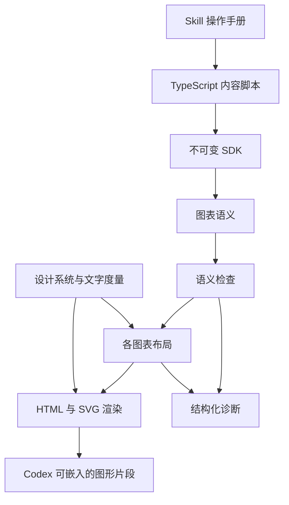

# 架构

SDK 是内容作者的边界。作者声明身份、职责、关系、顺序、组件分区、流程泳道、分类标签、节点宽高和架构或泳道节点的 x、y 位置；设计系统决定颜色、字形度量和绘制规则。每次编译只处理一张图，输出交给 Codex 的原生可视化容器展示。

## 模块责任

| 模块                     | 输入与输出                         | 责任                                                     |
| ------------------------ | ---------------------------------- | -------------------------------------------------------- |
| `model.ts`               | 输入声明、图表语义与布局结果的类型 | 用只读字段和可区分的类型表达数据约束                     |
| `sdk.ts`                 | TypeScript 调用到图表语义          | 不可变图表声明、位置与尺寸声明、对象和职责归并           |
| `validate.ts`            | 图表语义到合法图表或诊断           | 标签一致性、唯一性、分区和泳道归属与容量检查             |
| `validate-sequence.ts`   | 时序步骤到诊断                     | 同步调用栈、返回顺序与分支汇合检查                       |
| `design.ts`              | 角色和文字到颜色与固定排版度量     | 统一视觉规则，不接受内容脚本的样式覆盖                   |
| `layout/architecture.ts` | 架构声明到几何结果                 | 应用坐标和尺寸、检查分区边界与节点重叠                   |
| `layout/swimlane.ts`     | 泳道声明到几何结果                 | 按声明高度排列泳道、应用节点局部坐标、检查边界与重叠     |
| `layout/routing.ts`      | 位置和关系到连接路径               | 正交路由、障碍检查与沿线标签；泳道连线限制在内容范围内   |
| `layout/sequence.ts`     | 时序语义到几何结果                 | 参与者、执行条、调用、返回、自调用与条件片段             |
| `render.ts`              | 合法图表和几何结果到 HTML 片段     | 单图、图例和结构化节点资料                               |
| `render-svg.ts`          | 几何结果到 SVG                     | 节点链接、组件分区、泳道及标题栏、关系、执行条与控制片段 |
| `templates.ts`           | HTML 模板与占位值到 HTML           | 加载固定模板、转义文字并插入已生成的标记                 |
| `templates/`             | 片段模板、样式和交互源码           | 片段外框与节点资料、CSS、节点旁详情浮层和图内定位        |
| `cli.ts`                 | 本地 ES module 到文件              | 加载默认导出、诊断、原子写入                             |

SDK、示例和测试使用 TypeScript，浏览器交互使用带 JSDoc 类型标注的 JavaScript，统一进行严格类型检查。输入声明、图表语义和布局结果分别建模；运行时校验负责检查动态 JavaScript 数据、引用关系及几何约束。浏览器脚本原样读取，不编译或通过 `Function.toString()` 生成。最终片段不携带 TypeScript 编译器。

Node 直接运行 TypeScript 源码，无需项目构建。模板资源按模块文件的位置加载，不依赖调用方的工作目录；渲染时内嵌 CSS 和 JS，输出是一个无外部资源的 HTML 片段。

片段骨架、图表外框和节点资料分别放在 `src/templates/` 的 HTML 文件中，样式在 `diagram.css`，交互源码在 `interactions.js`。模板只做一次固定占位符替换：`{{name}}` 转义文字，`{{{name}}}` 插入渲染器生成的 HTML 或内置 CSS、JS；替换结果不再次解析。循环和条件仍由 TypeScript 处理，不引入模板引擎或执行模板表达式。SVG 几何绘制由渲染器生成。

内容脚本从 Skill 目录的 `src/index.ts` 导入接口，`src/cli.ts` 负责执行。分发的是完整 Skill 目录；分发测试在没有依赖和构建产物的目录中验证源码、模板及外部调用。

模块保持在同一个源码目录内。没有插件加载层、主题配置协议或多渲染后端抽象。

## 核心数据

`SemanticDiagram` 表示一张图的语义数据，包含 `version`、`entities`、`roles` 和单个 `chart`。`Diagram` 是由 SDK 创建的声明，`Chart` 是将对象与职责替换为标识后的数据。`compile(diagram)` 返回 `{ semantic, scene }`，`render(diagram)` 返回完整的嵌入片段。节点包含声明的宽高，架构和泳道节点另含局部坐标；数据不包含函数、DOM 或任意样式，能够直接 JSON 序列化。

脚本直接默认导出 `architecture(...)`、`sequence(...)` 或 `swimlane(...)`。SDK 不提供文档组合、正文解析或跨图页面状态。每张图独立生成，需要多个视角时由正常对话组织多个片段。

对象身份与对象在图中的出现分离。图表的 `nodes` 或 `participants` 引用对象标识，并附带本图角色和 `size`；架构对象声明所属分区和局部位置，泳道活动声明必填的泳道归属和局部位置。对象定义包含可选的单行 `description` 摘要与 `tags` 分类标签。标签是限定字段的 `{ id, label }` 数据，不是任意属性容器。对象定义相同即可复用，不依赖 JavaScript 对象引用相等。

`ArchitecturePartition` 的含义是“架构图分区”，只属于当前架构图，表示按共同职责或归属划定的组件分组，例如功能分组或部署区域；它本身不是实体。`partitions` 只定义在架构图声明上，`partition` 只定义在架构节点上。分区不进入共享身份注册表，不承担角色、详情或关系端点；成员通过分区标识引用它。布局分别输出 `nodes` 和 `partitions`，渲染分别绘制交互节点与非交互虚线框。

公共节点声明只包含对象、角色和尺寸。SDK 分别校验各图表允许的字段，并由架构专属的节点与分区解析函数处理分区声明。共享几何与路由只处理矩形、坐标和障碍，不包含分区语义；其他图表按自身需要定义组织方式。

`Lane` 表示泳道图中的一个负责方，只含本图标识、名称和高度；活动通过 `lane` 指定归属。`SwimlaneChart` 声明共用的总宽度 `width` 和标题栏宽度 `headerWidth`。输入可以省略 `headerWidth`，SDK 将其规范化为 144；图表语义保留具体数值，布局据此计算标题换行、节点原点和路由边界。泳道按数组顺序从上到下紧邻排列，标题栏宽度在整张图内保持一致。泳道是独立语义类型，不借用架构分区的自由定位模型；它不进入实体表，也不作为关系端点。布局输出 `lanes`，渲染绘制实线边界和负责人标题。

图表具有不同关系模型：架构图使用 `relations` 与独立的 `partitions`，泳道图使用 `relations` 与独立的 `lanes`，时序图使用递归 `steps`。泳道关系表达活动流转，多个出边可以附带条件标签，回退仍是方向关系；当前不校验互斥条件、并行执行或 BPMN 网关语义。时序普通消息规范化为调用，带 `replyTo` 的消息规范化为返回。执行状态由同步调用栈决定，不通过给箭头机械附加矩形来模拟。

布局结果保留图表、对象和关系标识，以及矩形、连线路径、标签、执行区间和条件片段的位置。HTML 通过这些标识建立图内引用；同一对象在本图中只有一份详细资料。

## 确定性与取舍

- 在相同 SDK、Node/ICU 版本和相同输入下，生成的 HTML 字节一致。不写时间戳、随机图形标识或运行时布局脚本。交互脚本是固定的系统代码，不包含内容作者的代码。
- 图中文字采用系统等宽字体和固定前进宽度。前进宽度是排版为字符分配的横向空间；ASCII 为字号的 0.62 倍，其他字素为一倍。按完整 Unicode 字素换行，再将相同宽度写入 SVG 的 `textLength`。这使布局与实际绘制采用相同空间约束，无需浏览器参与构建。
- 字素是用户看到的一个完整字符，例如带音调的字母或组合 emoji。固定前进宽度保证几何可控，但不是自然字体的精密度量；不同系统的字形和正文换行仍可能不同，不能保证跨系统像素完全一致。
- 角色按图内标识排序后映射到宿主的六个 `--viz-series-*` 分类色，同一图内保持一致。不同图的角色集合不同，颜色可能重新分配；颜色不承担对象身份。
- 节点以 10% 角色分类色和 90% 宿主背景色混合填充，以角色分类色绘制边框，边框宽度为 2.5，定位时为 3.5，悬停和键盘聚焦保持原有边框与配色。
- 架构与泳道节点仅提供四条边中点作为连接点，多条关系可以共用中点。路由从这四个位置选择起止侧，端点不再按关系数量和顺序沿边分配；自循环使用不同侧。时序消息仍连接生命线和执行条，由调用顺序决定纵向位置。
- 架构与泳道路由在障碍外围生成多条平行通道，同时比较标签的居中、靠近线段两端及换行方案。标签最多 3 行，收窄时保留可完整显示的英文词。候选先避开节点、标题和标签，再依次比较与其他关系的重叠长度、交叉数量、线长与转弯代价、标签高度；共同端点的引线也计入重叠长度。引线默认长 18 像素，狭窄通道中缩短到与前方障碍间距的一半，再执行同样的节点避障检查，避免固定引线使可用连接侧失效。按最短可用路径和关系标识确定稳定处理顺序，初次分配后最多重排 3 轮，每次只接受整体目标改善的替换。返回的关系仍按声明顺序排列。优化减少冲突，但不承诺任意图都无重叠或交叉。
- 路由空间区分路径与标签共用的障碍和仅限制标签的障碍。分区标题障碍采用渲染文本块的实际位置和尺寸，由路由统一添加避让距离，避免重复扩大标题范围。架构分区与泳道边框按 1 像素宽的边线加入标签障碍；标签按背景矩形外沿保留 2 像素间距，连线仍能跨区域流转。同排节点间的连接会按这些边框分隔出的空白区间计算标签换行宽度，保留字号和最多 3 行的限制。共享路由只接收矩形，不解释分区或泳道的业务含义。
- `compile()` 生成的节点宽高与架构、泳道节点位置采用声明值。系统检查文字和区域内节点是否放得下，并选择避开节点、区域标题和标签的正交路径。架构与泳道共用路由，调用方提供标题障碍矩形；泳道另外提供整组泳道内容区的边界，约束路径和标签背景不越界，架构仍由布局结果决定画布范围。路由采用有限候选路径，不承诺解决任意复杂的障碍排列；找不到清晰连接时返回诊断，请作者增加留白或调整位置。
- 同步调用在接收者上开启执行条，返回结束执行条。自调用和递归通过横向错开的执行条表达。互斥分支继承进入时的调用状态，各自验证并在结束时汇合；跨分支的外层执行按路径分段绘制。当前不支持没有明确结束的执行区间或异步调用。
- 片段容器使用宿主提供的可用宽度，背景、文字与角色颜色引用宿主 CSS 主题变量，随应用主题变化自动重新绘制。CSS 限定在 `.diagram-widget` 内，不设置 `html`、`body`、`:root`、`color-scheme` 或宿主主题变量。明暗状态与变量更新由 Codex 渲染环境处理，不添加主题监听脚本或独立调色板。容器宽度不足时整张 SVG 等比例缩小，文字一同缩放。时序图参与者之间保留 40 像素的原始间距。画布宽度上限为 1280 像素。
- 图表通过 SVG 标题、说明和节点名称提供可访问信息，颜色之外保留对象标签与关系方向。架构关系直接在线旁标注；时序消息保留阅读编号。

## 容器缩放

编译仅计算一份几何布局，渲染输出一张带原始宽高和 `viewBox` 的 SVG。CSS 的 `max-width: 100%` 与 `height: auto` 使其按可用宽度等比例缩小，宽度充足时保持原始尺寸。不使用容器查询、宽度档位或浏览器布局脚本。

节点、连线、文字、分区、泳道和时序执行结构一同缩放，原始几何不变。标题与角色图例在图形外保持正常字号并换行。高度按比例自然变化，整个图表随宿主页面滚动，不限制区域高度，不引入内部滚动。

`--check` 检查与渲染相同的语义和几何布局，不生成 HTML。

## 错误与执行边界

声明错误在 SDK 调用处返回。语义检查尽量汇总多个引用或关系错误；布局遇到重叠、连线无法放置、文字或尺寸超限时停止并给出位置和修改建议。不会删除关系、截断文字或自动改变语义；原始声明和几何保持不变，浏览器仅缩放显示。

CLI 直接执行本地 ES module，拥有普通 Node 进程的权限。它不提供不可信代码执行服务或隔离环境。最终 HTML 不包含作者脚本，布局与内容已经在构建阶段确定。

节点详情当前由 `design.ts` 中的 `nodeDetailsEnabled` 开关停用，意为是否启用节点详情；恢复为 `true` 即重新启用。节点不再显示详情链接或提示，悬停与键盘强调不受影响。详情模板、资料和交互实现保留。以下描述启用后的行为。

节点资料由已有的名称、摘要、标签、职责、分区或泳道归属与关系生成。固定交互脚本通过根元素标识查找当前片段，只在根元素内查询节点和处理点击。点击节点用原生 `popover` 显示对应资料，点击关联节点关闭详情，并定位图中的目标、聚焦和高亮。关闭按钮或 Escape 从浮层内关闭时将焦点还给打开入口；点击图中空白清除定位标记。

详情没有富文本或自由正文入口。内容统一转义，只有内置模板和脚本能产生标记。脚本不改写地址片段、浏览器历史或宿主根元素，不依赖网络与全局页面事件。浮层优先贴近节点侧边，空间不足时放在上方或下方，并按当前嵌入容器边界约束位置。它不显示蒙层，不限制键盘焦点，点击其他节点直接切换详情。原生 `popover` 管理点击外部与 Escape 关闭；图表滚动和尺寸变化时重新定位。片段不创建完整页面。

构建完成后才原子替换目标文件；检查或布局失败不会覆盖旧产物。

架构图、时序图和泳道图共用节点悬停与键盘聚焦的关联强调。SVG 渲染器根据关系两端生成直接相邻节点集合和当前图表范围内的 CSS `:has()` 选择器，覆盖入线、出线、自循环和返回线。当前节点、直接相邻节点及相连关系保持完整不透明度，其余节点、路径和关系标签降至 0.45；强调范围只扩展一层，孤立节点也能单独聚焦。关系的 `variant`（样式预设）在 SDK 入口校验并补全为 `default`，随语义数据和布局结果传递。`relationStyles`（关系样式表）在设计层集中定义五种预设的主题色、线宽、虚线模式和字重。渲染按预设绘制关系路径、箭头和文字，不读取起点或终点的节点颜色。悬停或聚焦时保留预设颜色和线型，线宽增加 1，文字加粗。时序布局用 `returning` 标明返回语义，独立于样式：返回始终使用开口箭头与短虚线，调用使用实心箭头并采用预设线型。返回箭头按常态及悬停的实际线宽生成标记，尺寸固定。

悬停单条关系线或其文字时，仅强调该关系及其起点和终点，不延伸到端点的其他关系或相邻节点。每条关系增加沿原路径的透明命中区域，宽度为 12 屏幕像素，不随图表缩放变窄，绘制在节点下方以保留节点的悬停入口。关系命中区域与文字使用相同的强调范围，自循环只强调一个端点。

节点强调使用全图统一的中性阴影色，由 `--node-shadow-color`（节点阴影颜色）引用宿主前景色并混入透明度，随明暗主题变化。当前节点的阴影范围比相邻节点更大，二者颜色相同。悬停和键盘聚焦时保留原有边框颜色与粗细，不进一步加粗；键盘焦点轮廓仍保留。阴影只作用于节点矩形，文字保持锐利；通过阴影和背景弱化形成前后层次，不改变节点坐标、尺寸或绘制顺序。选择器跟随 `:hover` 和 `:focus-visible` 状态自动恢复，不增加 JavaScript 状态或事件监听，也不会联动其他图中的同名节点。阴影、不透明度和关系加粗均立即切换，不添加过渡动画，避免快速移动指针时出现滞后。强调规则仅用于屏幕显示；定位标记继续由原有交互逻辑维护。

箭头的 `context-stroke` 表示使用所属关系路径的描边颜色，使复用同一箭头形状的不同关系各自保留颜色。箭头使用 `markerUnits="userSpaceOnUse"`，按画布单位固定尺寸，避免高亮线条加粗时箭头同步放大。返回箭头的绘制区域为描边保留边距，并用箭头内的实线短杆连接尖端，避免虚线末段恰好落在间隙时出现断开；普通和高亮状态共用相同的箭头几何形状。

## 验证

`pnpm test` 先运行 TypeScript 严格检查，`test/contracts.ts` 用编译期反例验证 API 约束；随后运行测试，覆盖图表声明、身份和标签一致性、显式尺寸、分区和泳道边界、同步执行生命周期、分支汇合、文字转义、确定性、片段输出契约、几何边界和 CLI 文件行为。`pnpm example`、`pnpm example:sequence` 与 `pnpm example:swimlane` 分别生成三种图表片段。分发测试在无依赖、无构建产物的 Skill 副本中执行 CLI，并验证外部内容脚本调用。

浏览器检查包括详情打开、关闭与焦点恢复、关联节点定位、分区与泳道边界、沿线文字、执行条与返回箭头，以及 320 至 1024 像素容器内的布局切换、文字可读性和横向溢出。检查时可将片段放在测试页面的 iframe 中模拟宿主；该页面只是开发检查工具，不是产品输出。仅测试语义模型不能证明视觉可读性。
